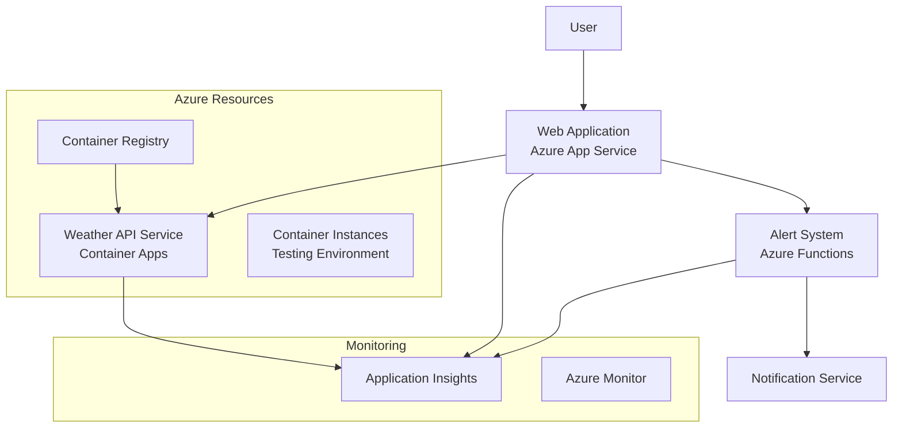

# ☁️ Weather Tracker
Project inspired by madebygps

A real-time weather tracking application built on Azure cloud services that notifies users about weather changes in their selected cities.


## 🎯 Project Overview

Weather Tracker is a cloud-native application that demonstrates implementing Azure compute solutions. The application allows users to:
- Track real-time weather updates for multiple cities
- Receive automated alerts when weather conditions meet specific thresholds
- View historical weather data and trends

## 🏗️ Architecture



## 🛠️ Infrastructure Components

| Service | Purpose |
|---------|----------|
| Azure App Service | Hosts the main web application |
| Azure Container Registry | Stores and manages Docker images |
| Azure Container Instance | Provides testing environment |
| Azure Functions | Powers the weather alert system |
| Azure Container Apps | Runs production containers |
| Application Insights | Monitors application performance |

## 📋 Implementation Steps

### 1. Environment Setup
- [x] Create Azure resource group
- [ ] Configure Azure App Service
- [ ] Set up Azure Container Registry

### 2. Application Development
- [x] Develop web interface
- [x] Integrate weather API
- [ ] Create Docker configuration
- [ ] Implement alert system using Azure Functions

### 3. Container Management
- [ ] Build Docker images
- [ ] Push to Azure Container Registry
- [ ] Test with Azure Container Instance
- [ ] Deploy to Azure Container Apps

### 4. Monitoring & CI/CD
- [ ] Configure Application Insights
- [ ] Set up Azure Monitor
- [ ] Establish CI/CD pipeline
- [ ] Create monitoring dashboards

## 🚀 Getting Started

1. Clone the repository
```bash
git clone https://github.com/yourusername/weather-tracker.git
cd weather-tracker
```

2. Set up Azure resources
```bash
az group create --name WeatherTracker --location eastus
az acr create --resource-group WeatherTracker --name weathertrackerregistry --sku Basic
```

3. Build and push Docker image
```bash
docker build -t weatherapp .
az acr login --name weathertrackerregistry
docker tag weatherapp weathertrackerregistry.azurecr.io/weatherapp
docker push weathertrackerregistry.azurecr.io/weatherapp
```

## 📊 Architecture Details

### Web Application (Azure App Service)
- Handles user interactions
- Processes weather data
- Manages user preferences

### Weather Alert System (Azure Functions)
- Monitors weather conditions
- Triggers alerts based on thresholds
- Processes weather data in real-time

### Container Management
- Images stored in Azure Container Registry
- Testing performed in Container Instances
- Production workloads run in Container Apps

## 🔍 Monitoring

The application uses:
- Application Insights for performance monitoring
- Azure Monitor for resource metrics
- Custom dashboards for real-time overview

## 📝 Documentation

Detailed documentation is available in the `/docs` folder:
- [Setup Guide](docs/setup.md)
- [API Documentation](docs/api.md)
- [Architecture Overview](docs/architecture.md)


